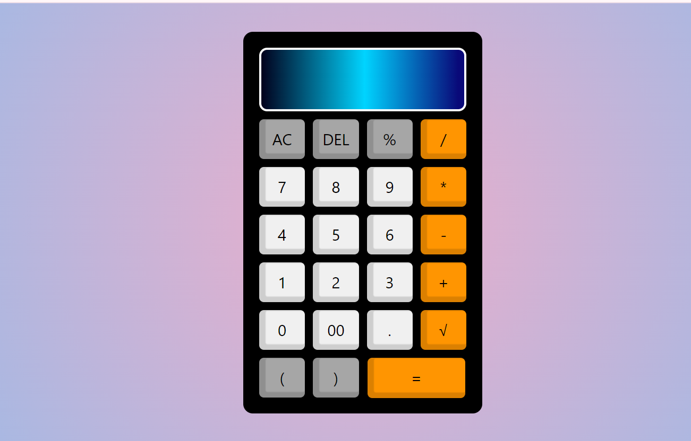

# X-Calculator




# [Deployment Link](https://x-calculators-ravi.netlify.app/)

## Overview
**X-Calculator** is a simple yet powerful calculator web application that allows users to perform basic arithmetic operations like addition, subtraction, multiplication, and division. The calculator is built using modern web technologies such as HTML, CSS, and JavaScript. It provides a user-friendly interface, making it easy for anyone to use.

## Features
- Basic arithmetic operations: Addition, Subtraction, Multiplication, Division, SquareRoot and Percentage.
- Responsive design for optimal viewing on different devices.
- Clear functionality to reset calculations.
- Error handling for invalid inputs or operations (like division by zero).

## Technologies Used
- **Frontend**: 
  - HTML5
  - CSS3
  - JavaScript

## Installation

1. **Clone the repository:**
   ```bash
   git clone https://github.com/ravikumar9519/X-Calculator.git
   cd X-Calculator

